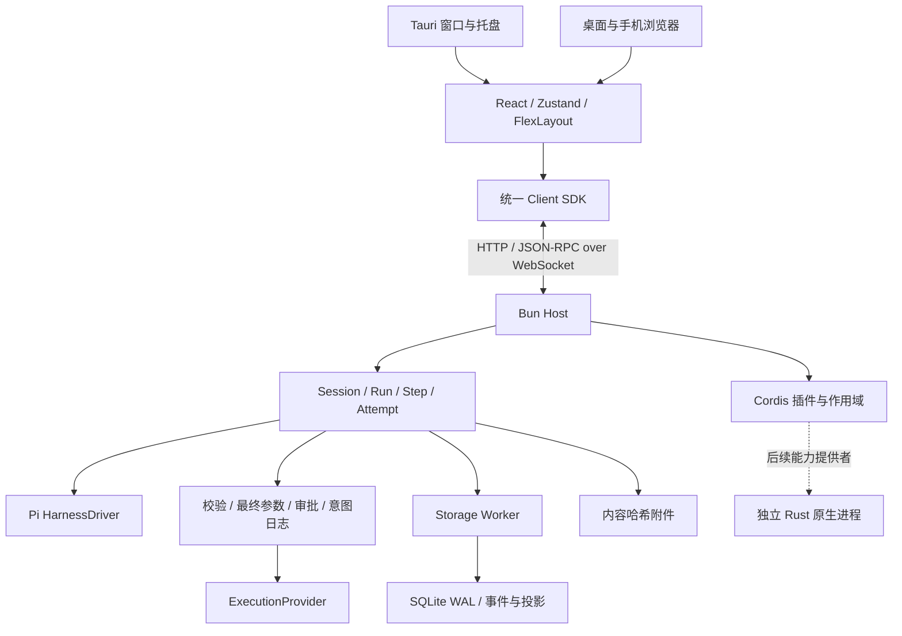

# 架构与边界

## 进程和依赖方向

Host 与 UI 的进程生命周期分离。React 业务组件通过 SDK 访问 Host；只有桌面适配模块导入 Tauri API。Rust 负责桌面集成，目前没有将 Session 或模型调用搬入 Rust。原生能力未来通过独立进程实现，必须支持由无 UI 的 Host 启动。

## 运行模型

持久化原子关系为 `Workspace → Session → Run → Step → Attempt/ToolCall`。

- Session 是持久历史和队列的归属。每个 Session 只能 claim 一个活动 Run，不同 Session 并发。
- Run 是一条已接纳输入。`requestId` 在 Session 内唯一；重复输入返回原 Run，重复标识搭配不同输入会报冲突。
- Step 对应一次模型请求及随后的工具执行。每次请求记录独立 Attempt ID。当前关闭 SDK 隐式重试，失败由用户显式重发，防止用量和副作用被隐藏。
- Pi 通过可等待事件回调接入；hbar 拥有日志、工具注册、权限入口和会话状态，不依赖 Pi 的文件格式或 UI。
- 扩展点为 `context.build`、`model.request`、`tool.before`、`tool.after`、`step.end`、`run.end`。
- 取消请求立即中止对应 AbortController。排队输入可单独取消。窗口关闭、浏览器断线不会取消 Run。

默认限制：单 Run 20 分钟、64 个 Step，Shell 120 秒；工作区文件读写 2 MiB，聊天附件 10 MiB、每条输入最多 12 个混合附件，文本附件传给模型前最多 120,000 个字符，WS 输入帧 1 MiB、每个连接最多 32 个在途命令，慢客户端断开后以快照恢复。默认工具顺序执行。可信插件必须遵守 AbortSignal 和 disposer，故意忽略它们的插件需要未来的进程隔离才能强制约束。

## 持久化与恢复

`bun:sqlite` 仅由独立 Worker 访问。WAL、FULL synchronous、事务确保事件追加、Session 序号和消息/运行投影一致。每个持久事件包含 `eventId/sessionId/seq/runId/stepId/version`。请求事件保存最终 system、消息、模型描述和工具 schema；消息事件包含规范化内容及供应商原始元数据，附件通过哈希引用恢复。

流式 UI 帧保存当前流 ID、内容及偏移，约每 33ms 合并发送。完整 assistant/tool 结果结算后才进入消息历史。已提交事件在崩溃后保留；尚未结算的流式增量可能丢失。取消或供应商失败的部分响应记录为 Attempt 事件，不当作完整 assistant 结果继续推理。

工具流程固定为：参数 schema → 插件前置处理 → 再次校验最终参数 → 策略/人工审批 → 记录意图 → 执行 → 后置处理 → 结果提交 → 意图结算。审批显示的就是最终参数。默认允许工作区内读取，写入和 Shell 请求批准。路径会检查实际路径和符号链接，Host 数据目录不向文件工具开放；批准的 Shell 和可信插件依然具备操作系统用户权限。

重启会把活动 Run 标记为 interrupted，未结算意图标记为 unknown，并写入要求核实的工具结果。没有开始执行的调用补充中断结果，保持工具调用协议完整。依赖该中断运行的队列被保留并标记中断，需要显式重新提交，不会自动重放未知副作用。

数据库以 `PRAGMA user_version` 管理版本。当前版本为 1，初始化在事务中执行，遇到比程序更新的版本拒绝打开。后续版本只能追加前向事务迁移；升级前备份整个数据目录，备份活跃数据库应使用 SQLite backup 或先停止 Host，不能只复制主文件而忽略 WAL。

摘要压缩在完整对话边界发生，原始消息不删除。上下文从最近摘要及之后的消息重建。分支以已结算 Run 边界截取，复制规范化历史与供应商元数据，后续写入独立。摘要 token 消耗计入同一 Session 用量。

## 协议与设备

HTTP 负责健康检查、一次性配对、附件、静态资源和可信 Client 插件模块。WS 采用版本 1 JSON-RPC，所有命令经同源 Zod schema 校验。事件重连先取分页快照和游标，再 follow；超过回放窗口要求重新快照，客户端按序号去重并缓冲乱序到达的增量。

配对码为短时一次性码，按来源地址限流；设备凭证保存哈希，撤销后关闭对应连接。Origin 与 Host 都进行检查。默认回环监听，可显式绑定 `0.0.0.0`；普通 HTTP 不提供 TLS 加密。跨端附件只通过已鉴权的接口访问，不把凭证放入 URL。LAN 页面不依赖仅安全上下文可用的 UUID/剪贴板 API。

## 插件作用域

| 作用域    | 生命周期与继承                                        |
| --------- | ----------------------------------------------------- |
| Host      | 一个数据目录的 Host 生命周期                          |
| Workspace | 按需创建，继承 Host，直到组合变更或 Host 关闭         |
| Session   | 按需创建，继承 Workspace，历史本身不受 scope 销毁影响 |
| Run       | 每次执行创建，继承 Session，运行结算时释放            |
| Client    | Host 中按网络连接创建；网页插件在相应客户端安装/卸载  |

工具和钩子使用作用域内注册表，子作用域继承父作用域；运行插件的同名工具不会在其他 Session 可见。服务使用 Cordis isolate/inject。依赖图检查 API/服务版本、缺失服务、重复 provider、循环和错误的作用域方向。单实现服务必须显式选择一个 provider，工具等注册表允许多个具名条目。

组合变更要求运行与队列空闲；配置先验证，再释放旧组合并应用新组合，失败回滚注册。驱动和存储的替换通过启动 profile 和 Host 重启完成。`KernelProfile.replacements` 选择必需能力的新实现；`createStorage` 提供同一 StoragePort 契约。示例只读策略可以在不改内核的情况下替换审批策略。

## 前端

FlexLayout 管理标签、拖动、分割、停靠、底部工具区和设备本地布局。Zustand 分离连接、目录、会话投影及工作台草稿/布局。历史按页加载并虚拟化；隐藏会话取消事件订阅，后端运行继续，重新打开时恢复快照。手机使用独立单面板导航，复用会话、审批和配置组件。

Markdown 使用 GFM 和 sanitize，禁用原始 HTML；外部图片不自动取回。Mermaid 使用 strict 配置，Recharts/ReactFlow 使用受 Zod 限制的 JSON。不会执行模型产生的 JSX/JavaScript。富内容、代码编辑器按需加载，解析失败保留源码入口。CodeMirror 6 提供代码高亮和工具写入前后对照，后续文件编辑/LSP 或 Monaco 可通过插件补充。

## 已交付能力与后续边界

| 功能                  | 实现归属与依赖                                                                                                                   |
| --------------------- | -------------------------------------------------------------------------------------------------------------------------------- |
| 目标、计划            | 已交付独立插件；通过 SessionService、运行钩子、持久化状态和策略服务提供 Goal、Plan 模式                                          |
| Token 预算            | 已交付独立插件；消费核心 usage 事件，按 Session 持久化结算并在额度耗尽时阻止新运行                                               |
| Skills、memory        | 文档/存储插件；context.build 注入，来源与最终注入内容写入请求日志；向量检索独立 provider                                         |
| 调度、后台任务        | 调度插件；持久触发标识、时区、下一次运行和幂等 run.submit；目标为可选依赖                                                        |
| Sub-agents            | 创建独立 Session；父子关系、取消传播、预算归属均由插件负责                                                                       |
| 团队                  | 依赖子代理；任务 DAG、成员和持久邮箱；基础 Session 不依赖团队                                                                    |
| 统计、Trace、diagnose | 当前已有用量、事件查看和只读诊断；聚合报表、完整 Trace 和修复流程后续插件扩展                                                    |
| 多模态                | 已交付图片输入和受鉴权的混合文件附件；文本文件按上限注入模型，非图片附件以下载引用显示；音视频、生成、转码仍由独立 provider 扩展 |
| IM、MCP               | 消息/工具适配插件；复用审批、幂等和运行入口；维护外部会话映射                                                                    |
| 终端                  | 后续 xterm.js + Bun PTY；当前 Shell 工具不是交互式终端                                                                           |
| browser-use           | 受管浏览器 + Playwright，画面与输入通过 Host 转发；不依赖任意网站 iframe                                                         |
| computer-use          | Host 启动的原生 provider；OS 授权、捕获与输入权限单独管理                                                                        |
| 插件仓库              | 本地加载和配置已实现；下载安装、升级、签名与强隔离后续实现                                                                       |

能力及开发方式参考本地 Pi、Cordis 和 DeepSeek Harness；hbar 使用自己的 DTO、服务接口与 Client SDK，未声明 DSH 插件的二进制或源码零修改兼容。
